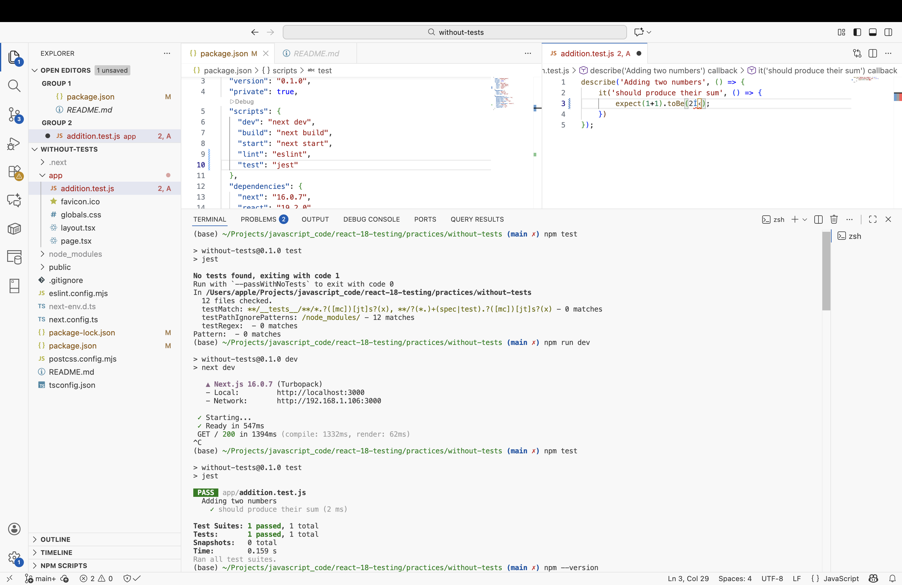

# Testing in React 18 - Practice Repo.

> Testing in React 18  
> by Liam McLennan  
> https://app.pluralsight.com/library/courses/react-18-testing/table-of-contents

Demo version
```bash
$ node --version
v22.19.0
```

## Creating a React Application with a Test

```bash
npx create-next-app --example with-jest testing-react
```

Then we can run test via commands below:
```bash
npm run test
```
or 
```bash
npm run test:ci
``` 
or (show details of test items/names)
```bash
npm run test:ci -- --verbose
```


## Adding Tests to an Existing React Application

```bash
npx create-next-app without-tests
cd without-tests
npm install jest --save-dev
```

### Then

1. Add `"test":"jest"` in the script block of _package.json_, 
2. Run 'npm test' to get match pattern, (e.g., `testMatch: **/__tests__/**/*.?([mc])[jt]s?(x), **/?(*.)+(spec|test).?([mc])[jt]s?(x) - 0 matches`)
3. Create a test file (naming with the match pattern, e.g., _*.test.js_) for demo, 
4. Run 'npm test' to run the test file.
 
### Result

